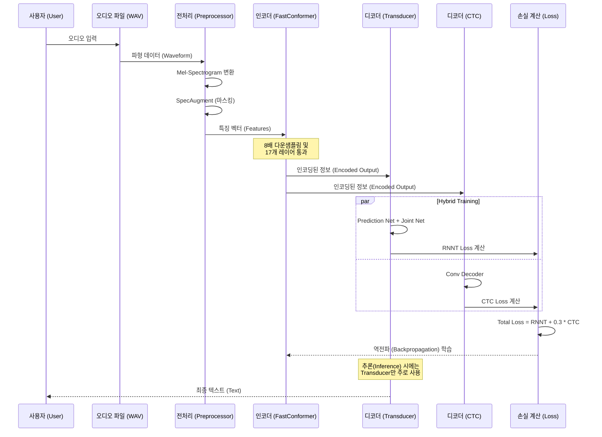

# FastConformer Hybrid Transducer-CTC 모델 설계 및 설명서

이 문서는 `fastconformer_hybrid_transducer_ctc_bpe.yaml` 설정 파일을 기반으로 작성된 **FastConformer Hybrid Transducer-CTC** 모델의 설계서입니다. AI 초보자도 이해할 수 있도록 모델의 구조, 학습 단계, 성능 개선 방법 등을 상세히 설명합니다.

## 1. 개요 (Overview)

**FastConformer Hybrid Transducer-CTC**는 음성 인식(ASR, Automatic Speech Recognition)을 위한 최신 딥러닝 모델입니다. 이 모델은 **FastConformer**라는 빠르고 효율적인 인코더(Encoder)와 **Hybrid Transducer/CTC** 디코더(Decoder) 구조를 결합하여 높은 인식 정확도와 학습 안정성을 동시에 제공합니다.

*   **FastConformer**: 기존 Conformer 모델보다 연산 속도가 훨씬 빠르면서도 성능은 유지하는 인코더입니다. 긴 오디오 입력을 효과적으로 처리하기 위해 다운샘플링(Subsampling) 기술을 적극적으로 사용합니다.
*   **Hybrid Transducer/CTC**: 두 가지 방식의 디코딩(Transducer, CTC)을 동시에 사용하여 학습합니다.
    *   **Transducer (RNNT)**: 문맥을 고려하여 높은 정확도를 보이지만 학습이 까다로울 수 있습니다.
    *   **CTC (Connectionist Temporal Classification)**: 구조가 단순하고 학습이 안정적입니다.
    *   **Hybrid**: CTC로 학습의 방향을 잡아주고(가이드), Transducer로 최종적인 정확도를 높이는 방식입니다.

---

## 2. 모델 구조 (Model Architecture)

이 모델은 크게 **전처리(Preprocessor)**, **인코더(Encoder)**, **디코더(Decoder)** 세 부분으로 나뉩니다.

### 2.1 구조 다이어그램 (Mermaid)

```mermaid
graph TD
    %% Nodes with Shapes
    Input[오디오 입력 (Audio Signal)<br/>Shape: B, T_audio] -->|Waveform| Preprocessor[전처리: MelSpectrogram<br/>Shape: B, 80, T_spec]
    Preprocessor --> SpecAug[데이터 증강: SpecAugment<br/>Shape: B, 80, T_spec]
    SpecAug --> Encoder_In(인코더 진입)
    
    subgraph Encoder_Detail [FastConformer Encoder]
        direction TB
        Encoder_In --> Subsampling[Subsampling 8x<br/>Shape: B, 512, T_enc]
        Subsampling -->|T_enc = T_spec / 8| E_Layers[Conformer Layers (17 layers)<br/>Shape: B, 512, T_enc]
        E_Layers --> E_Out[Encoder Output<br/>Shape: B, 512, T_enc]
    end
    
    Encoder_Detail --> Joint_Input_Enc
    Encoder_Detail --> CTC_Input
    
    subgraph Transducer_Path [Transducer (RNNT) Decoder]
        direction TB
        Target[타겟 텍스트 (Target Tokens)<br/>Shape: B, U] --> Pred_Net[Prediction Net (LSTM)<br/>Shape: B, U, 640]
        
        Joint_Input_Enc(From Encoder) --> D_Joint[Joint Net<br/>Add & ReLU]
        Pred_Net --> D_Joint
        
        D_Joint -->|Joint Tensor<br/>B, T_enc, U, 640| D_Proj[Project to Vocab]
        D_Proj -->|Logits<br/>B, T_enc, U, V+1| Loss_RNNT[RNNT Loss]
    end
    
    subgraph CTC_Path [Auxiliary CTC Decoder]
        direction TB
        CTC_Input(From Encoder) --> C_Conv[ConvASRDecoder<br/>Proj to Vocab]
        C_Conv -->|Logits<br/>B, T_enc, V+1| Loss_CTC[CTC Loss]
    end
    
    Loss_RNNT --> Total_Loss[최종 손실 (Total Loss)]
    Loss_CTC --> Total_Loss
```

> **Shape 표기법 설명 (Legend):**
> *   **B**: 배치 크기 (Batch Size)
> *   **T_audio**: 오디오 샘플 길이 (Time steps of raw audio)
> *   **T_spec**: 스펙트로그램 시간 길이 (Time steps of spectrogram)
> *   **T_enc**: 인코더 출력 시간 길이 (Time steps after subsampling, approx T_spec / 8)
> *   **U**: 타겟 텍스트 길이 (Label length)
> *   **V**: 단어 사전 크기 (Vocabulary Size)
> *   **512, 640**: 각 단계의 특징 차원 크기 (Hidden Dimension)

### 2.2 상세 설명

1.  **전처리 (Preprocessor)**:
    *   사람의 귀가 소리를 듣는 방식과 유사하게 오디오 파형을 **Mel-Spectrogram**이라는 이미지 형태의 특징(Feature)으로 변환합니다.
    *   `AudioToMelSpectrogramPreprocessor`를 사용하며, 16kHz 샘플링 레이트와 80개의 특징 차원(features)을 가집니다.

2.  **데이터 증강 (SpecAugment)**:
    *   학습 데이터를 인위적으로 변형하여 모델이 다양한 환경에서도 잘 동작하도록 만듭니다.
    *   주파수(Frequency)나 시간(Time) 축의 일부를 가려버리는 마스킹(Masking) 기법을 사용합니다.

3.  **인코더 (Encoder - FastConformer)**:
    *   소리의 특징을 추출하여 언어적인 정보로 압축하는 핵심 부품입니다.
    *   **Subsampling**: 입력 길이를 1/8로 줄여 연산량을 대폭 감소시킵니다 (`subsampling_factor: 8`).
    *   **Conformer Layers**: 17개의 층(`n_layers: 17`)으로 구성되며, 각 층은 Self-Attention(전체 문맥 파악)과 Convolution(국소 특징 파악)을 결합하여 소리를 이해합니다.
    *   `d_model: 512`는 모델 내부에서 정보를 처리하는 벡터의 크기입니다.

4.  **디코더 (Decoder)**:
    *   **Transducer (RNNT)**: 인코더의 출력과 이전에 예측한 단어들을 결합하여 다음 단어를 예측합니다. `Prediction Net`과 `Joint Net`으로 구성됩니다.
    *   **Auxiliary CTC**: 인코더의 출력만 보고 각 시점의 글자를 예측합니다. 학습 시 보조적인 역할을 하여 수렴 속도를 높입니다 (`ctc_loss_weight: 0.3`).

---

## 3. 데이터 처리 및 시퀀스 (Data Flow & Sequence)

오디오 파일이 입력되어 텍스트로 변환되기까지의 과정을 시퀀스 다이어그램으로 표현합니다.

### 3.1 시퀀스 다이어그램 (Mermaid)



### 3.2 입출력 포맷 (I/O Formats)

*   **입력 (Input)**:
    *   형식: 오디오 파일 (WAV, FLAC 등)
    *   샘플링 레이트: 16000Hz (16kHz)
    *   채널: 모노 (Mono)
*   **출력 (Output)**:
    *   형식: 텍스트 문자열 (String)
    *   토크나이저: BPE (Byte Pair Encoding) 방식을 사용하여 서브워드(Sub-word) 단위로 출력된 후, 다시 문장으로 합쳐집니다.

---

## 4. 모델 학습 단계 (Training Steps)

설정 파일(`yaml`)에 정의된 학습 프로세스는 다음과 같습니다.

1.  **데이터 로딩 (Data Loading)**:
    *   `train_ds`: 학습 데이터를 불러옵니다. `bucketing_strategy`를 사용하여 길이가 비슷한 오디오끼리 묶어 학습 효율을 높입니다.
    *   `batch_size: 16`: 한 번에 16개의 샘플을 학습합니다.

2.  **최적화 (Optimization)**:
    *   **Optimizer**: `AdamW`를 사용합니다. 가장 널리 쓰이는 성능 좋은 최적화 알고리즘입니다.
    *   **Learning Rate (LR)**: `5.0`으로 시작하지만, `NoamAnnealing` 스케줄러에 의해 학습 초반에는 천천히 증가하다가(Warmup), 이후 점차 감소합니다. 이는 학습 초기 불안정함을 막고 후반부의 정밀한 튜닝을 돕습니다.

3.  **손실 함수 (Loss Function)**:
    *   기본적으로 Transducer Loss(RNNT)를 최소화하는 것이 목표입니다.
    *   여기에 CTC Loss를 30%(`ctc_loss_weight: 0.3`) 비율로 더해서 함께 최소화합니다. 이렇게 하면 모델이 더 빨리, 더 안정적으로 정답을 찾습니다.

4.  **학습 제어 (Trainer)**:
    *   `max_epochs: 1000`: 최대 1000번 데이터셋을 반복 학습합니다.
    *   `precision: 32`: 32비트 부동소수점 연산을 사용합니다. (메모리 절약을 위해 16으로 변경 가능)
    *   `accumulate_grad_batches: 1`: 그래디언트를 모아서 업데이트하지 않고 매 배치마다 업데이트합니다.

---

## 5. 성능 개선 방법 (Performance Improvement)

초보자가 시도해볼 수 있는 성능 개선 및 튜닝 포인트입니다.

1.  **배치 사이즈 조절 (Batch Size)**:
    *   GPU 메모리가 남는다면 `train_ds.batch_size`를 늘리세요. 학습 속도가 빨라지고 안정화됩니다.
    *   메모리가 부족하면 줄여야 하지만, 너무 작으면 학습이 불안정해질 수 있습니다. 이 경우 `accumulate_grad_batches`를 늘려서 보완할 수 있습니다.

2.  **모델 크기 변경 (Model Size)**:
    *   성능을 높이고 싶다면: `encoder.d_model`을 512보다 크게, `n_layers`를 17보다 많게 설정합니다. (단, 학습 속도가 느려짐)
    *   속도를 높이고 싶다면: 반대로 줄입니다.

3.  **데이터 증강 튜닝 (SpecAugment)**:
    *   `freq_masks`, `time_masks` 개수를 조절합니다. 데이터가 적다면 마스킹을 줄여서 모델이 너무 어렵게 학습하지 않도록 하고, 데이터가 많다면 마스킹을 늘려 과적합(Overfitting)을 방지합니다.

4.  **FastEmit 사용**:
    *   `loss.warprnnt_numba_kwargs.fastemit_lambda` 값을 0.001 정도로 설정하면, 스트리밍 환경에서 지연 시간(Latency)을 줄일 수 있습니다.

5.  **토크나이저 (Tokenizer)**:
    *   `tokenizer.dir`에 지정된 BPE 모델의 단어 사전 크기(Vocab size)를 조절합니다. 일반적으로 1024, 256 등을 사용하며, 언어의 특성에 따라 최적값이 다릅니다.

6.  **학습률 (Learning Rate)**:
    *   학습이 너무 더디면 `optim.lr`을 조금 높여보고, 손실(Loss)이 줄어들지 않고 튀면 낮춰봅니다.
