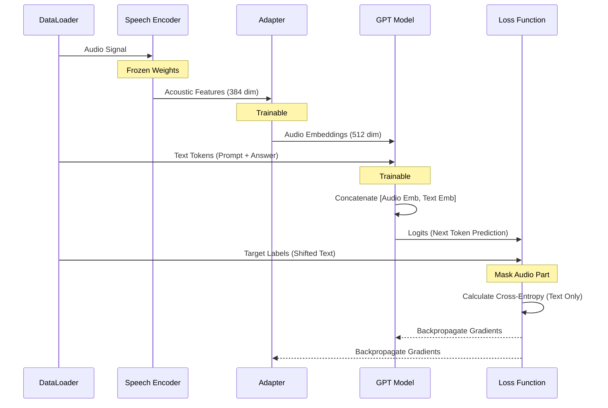

# SpeechLLM Architecture and Training Pipeline

## 1. Model Architecture
This diagram illustrates the high-level architecture of the SpeechLLM, combining a FastConformer encoder, an adapter, and a Small GPT model.

```mermaid
graph TD
    subgraph "Speech Encoder (Frozen in Stage 3)"
        AudioInput[Audio Signal] --> Preprocessor[Audio Preprocessor]
        Preprocessor --> FastConformer[FastConformer Encoder<br/>(12 Layers, d_model=384)]
        FastConformer --> AcousticFeatures[Acoustic Features<br/>(Batch, Time, 384)]
    end

    subgraph "Modality Adapter (Trainable)"
        AcousticFeatures --> AdapterLayer[ConvASRDecoder / Linear<br/>(Projection & Downsampling)]
        AdapterLayer --> AudioEmbeddings[Audio Embeddings<br/>(Batch, Time', 512)]
    end

    subgraph "LLM (Trainable)"
        TextInput[Text Input<br/>(Prompt + Answer)] --> Tokenizer
        Tokenizer --> TextEmbeddings[Text Embeddings<br/>(Batch, Text_Len, 512)]
        
        AudioEmbeddings --> Concat{Concatenate}
        TextEmbeddings --> Concat
        
        Concat --> CombinedInput[Combined Sequence<br/>(Audio + Text)]
        CombinedInput --> SmallGPT[Small GPT<br/>(12 Layers, d_model=512)]
        SmallGPT --> NextToken[Next Token Prediction]
    end

    style FastConformer fill:#f9f,stroke:#333,stroke-width:2px
    style AdapterLayer fill:#ff9,stroke:#333,stroke-width:2px
    style SmallGPT fill:#9cf,stroke:#333,stroke-width:2px
```

## 2. Training Stages
The training process is divided into three distinct stages to ensure stable convergence and optimal performance.

```mermaid
flowchart LR
    subgraph "Stage 1: ASR Pre-training"
        S1_Data[(ASR Data<br/>Audio-Text Pairs)] --> S1_Model[FastConformer ASR]
        S1_Model --> S1_Output((ASR Checkpoint<br/>.nemo))
    end

    subgraph "Stage 2: LLM Pre-training"
        S2_Data[(Text Data<br/>General Corpus)] --> S2_Model[Small GPT<br/>(Random Init)]
        S2_Model --> S2_Output((LLM Checkpoint<br/>.ckpt))
    end

    subgraph "Stage 3: SpeechLLM Fine-tuning"
        S3_Data[(Speech-Text Data)] --> S3_Model[SpeechLLM Combined]
        S1_Output -.->|Load Encoder| S3_Model
        S2_Output -.->|Load LLM| S3_Model
        S3_Model --> S3_Final((Final Model))
    end

    style S1_Model fill:#f9f
    style S2_Model fill:#9cf
    style S3_Model fill:#fc9
```

## 3. Training Mechanism (Stage 3)
Detailing how data flows and loss is calculated during the final SpeechLLM training stage.


